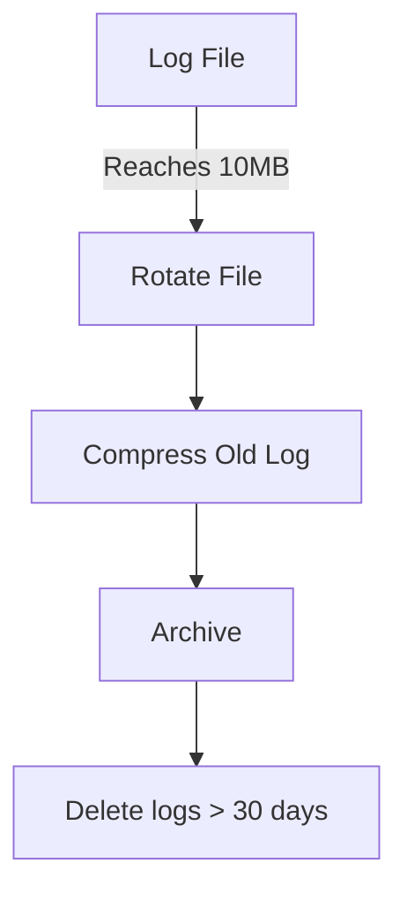

# Logging System Documentation

## 1. Overview 🔍

The project implements a comprehensive logging system with three main components:

1. 🔒 Security Logs (`security.log`)
2. 👥 User Operation Logs (`user_operations.log`)
3. 💾 Database Operation Logs (`database_operations.log`)

## 2. Log Files and Locations 📁

### 2.1 Security Logs
**File:** `logs/security.log`  
**Responsible Class:** `SecurityManager`

| Level | Event Type | Description | Example Message |
|:---:|:---|:---|:---|
| ✅ INFO | `TOKEN_VERIFIED` | Successful token verification | `2024-03-15 10:30:15 - INFO - TOKEN_VERIFIED: Token verified for user admin@example.com` |
| ⚠️ WARNING | `TOKEN_EXPIRED` | Token expiration | `2024-03-15 10:35:20 - WARNING - TOKEN_EXPIRED: Token expired at 2024-03-15 10:30:15` |
| ❌ ERROR | `TOKEN_ERROR` | Token verification failure | `2024-03-15 10:40:25 - ERROR - TOKEN_ERROR: Token verification failed: Invalid signature` |
| ✅ INFO | `ENCRYPTION` | File encryption operation | `2024-03-15 11:00:00 - INFO - ENCRYPTION: File encryption successful` |
| ❌ ERROR | `DECRYPTION_ERROR` | Decryption failure | `2024-03-15 11:05:00 - ERROR - DECRYPTION_ERROR: Decryption failed. Invalid password` |

### 2.2 User Operation Logs
**File:** `logs/user_operations.log`  
**Responsible Class:** `UserManager`

| Level | Event Type | Description | Example Message |
|:---:|:---|:---|:---|
| ✅ INFO | `USER_CREATED` | New user creation | `2024-03-15 12:00:00 - INFO - USER_CREATED: New user user@example.com created by admin@example.com` |
| ✅ INFO | `USER_DELETED` | User deletion | `2024-03-15 12:30:00 - INFO - USER_DELETED: User user@example.com deleted by admin@example.com` |
| ✅ INFO | `ROLE_CHANGED` | User role modification | `2024-03-15 13:00:00 - INFO - ROLE_CHANGED: Role changed from user to moderator` |
| ⚠️ WARNING | `LOGIN_ATTEMPT` | Failed login attempt | `2024-03-15 13:30:00 - WARNING - LOGIN_ATTEMPT: Failed login attempt for user@example.com` |
| ❌ ERROR | `ACCOUNT_LOCKED` | Account lockout | `2024-03-15 14:00:00 - ERROR - ACCOUNT_LOCKED: Account locked due to multiple failed attempts` |

### 2.3 Database Operation Logs
**File:** `logs/database_operations.log`  
**Responsible Class:** `DataManager`

| Level | Event Type | Description | Example Message |
|:---:|:---|:---|:---|
| ✅ INFO | `SCHEMA_UPDATED` | Schema modification | `2024-03-15 15:00:00 - INFO - SCHEMA_UPDATED: Database schema updated by admin@example.com` |
| ✅ INFO | `DATA_MODIFIED` | Data modification | `2024-03-15 15:30:00 - INFO - DATA_MODIFIED: Record #123 modified by user@example.com` |
| ⚠️ WARNING | `CONCURRENT_ACCESS` | Concurrent access warning | `2024-03-15 16:00:00 - WARNING - CONCURRENT_ACCESS: Multiple users accessing same record` |
| ❌ ERROR | `DATA_ERROR` | Data processing error | `2024-03-15 16:30:00 - ERROR - DATA_ERROR: Failed to process Excel file: Invalid format` |

## 3. Log Levels and Their Meanings 📊

### 3.1 INFO ✅
- Normal system operations
- Successful transactions
- Routine informational messages
- System state changes

### 3.2 WARNING ⚠️
- Potential issues
- Failed login attempts
- Expired tokens
- Performance warnings
- Resource thresholds

### 3.3 ERROR ❌
- Critical system failures
- Security violations
- Data integrity issues
- System exceptions
- Authentication failures

## 4. Log Rotation and Management 🔄

### 4.1 Rotation Policy


- Maximum file size: 10MB
- Daily rotation
- 30-day retention
- Compressed archiving

### 4.2 Log File Format
```plaintext
TIMESTAMP - LEVEL - EVENT_TYPE: MESSAGE
```

Example:
```plaintext
2024-03-15 10:30:15 - INFO - USER_CREATED: New user created: user@example.com
```

## 5. Log Monitoring and Analysis 📈

### 5.1 Security Monitoring
- Failed login tracking
- Token usage patterns
- Encryption operations
- Permission changes

### 5.2 Performance Monitoring
- Database operation timing
- Concurrent access counts
- Resource utilization
- Response times

### 5.3 User Activity Monitoring
- Session tracking
- Role modifications
- Data changes
- Account management

## 6. Log Access Permissions 🔑

| Role | Accessible Logs | Permissions | Access Level |
|:---:|:---|:---|:---:|
| 👑 Root | All logs | Read, Delete, Archive | ⭐⭐⭐ |
| 👨‍💼 Admin | User & DB Logs | Read | ⭐⭐ |
| 👨‍💻 Moderator | Own operation logs | Read Only | ⭐ |
| 👤 User | None | No Access | ❌ |

## 7. Best Practices 📝

### 7.1 Security Best Practices
- 🔒 Encrypt log files
- 🎭 Mask sensitive data
- 🔍 Regular permission audits
- 🔐 Access control enforcement

### 7.2 Management Best Practices
- 💾 Regular backups
- 🧹 Automated cleanup
- 📊 Periodic analysis
- 📈 Trend monitoring

### 7.3 Debugging Best Practices
- 🏷️ Unique error codes
- 📝 Detailed error descriptions
- 💡 Resolution suggestions
- 🔍 Context preservation

## 8. Example Log Analysis Queries 🔍

```python
# Last 24 hours failed login attempts
grep "LOGIN_ATTEMPT" logs/user_operations.log | grep "$(date -d '24 hours ago' +'%Y-%m-%d')"

# All actions by specific user
grep "user@example.com" logs/user_operations.log

# Critical security events
grep "ERROR" logs/security.log

# Today's schema changes
grep "SCHEMA_UPDATED" logs/database_operations.log | grep "$(date +'%Y-%m-%d')"
```

## 9. Log Analysis Tools 🛠️

### 9.1 Built-in Tools
- `grep` for text search
- `tail -f` for real-time monitoring
- `awk` for data extraction
- `sed` for log manipulation

### 9.2 Recommended External Tools
- 📊 Grafana for visualization
- 🔍 ELK Stack for advanced analysis
- 📈 Prometheus for metrics
- 🔔 Alert managers for notifications 