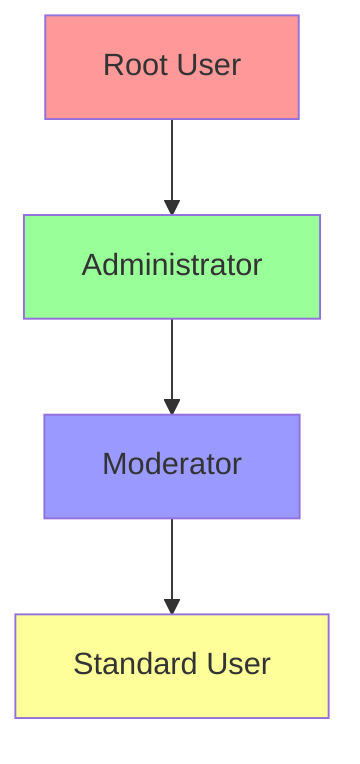
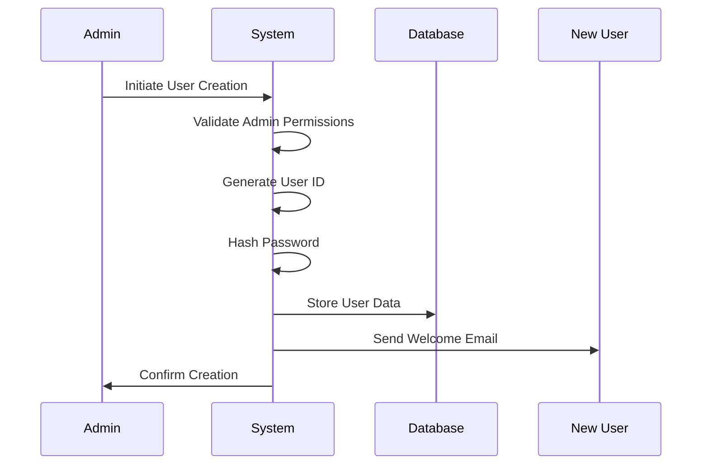

# Role-Based User Management System

## 📑 Table of Contents
1. [Overview](#overview)
2. [Role Hierarchy](#role-hierarchy)
3. [Permission System](#permission-system)
4. [User Management Operations](#user-management-operations)
5. [Security Features](#security-features)
6. [Implementation Details](#implementation-details)
7. [Best Practices](#best-practices)
8. [Troubleshooting](#troubleshooting)

## Overview

The Role-Based User Management System (RBUMS) is a comprehensive access control mechanism that manages user permissions and system access based on predefined roles. This system ensures secure and organized access to system resources while maintaining clear hierarchical structures.

### Key Components
- Role Hierarchy Management
- Permission Control System
- User Session Management
- Security Enforcement
- Audit Logging

### Core Benefits
- 🔒 Enhanced Security
- 🎯 Precise Access Control
- 📊 Clear Organization
- 📝 Comprehensive Logging
- ⚡ Efficient Management

## Role Hierarchy

### Role Structure


### Role Descriptions

#### 1. Root User
- **Access Level**: Complete system access
- **Capabilities**:
  - System configuration
  - Database management
  - User management (all levels)
  - Security settings
- **Restrictions**: None
- **Color Code**: 🔴 #ff9999

#### 2. Administrator
- **Access Level**: High-level system access
- **Capabilities**:
  - Database operations
  - User management (except root)
  - Configuration changes
- **Restrictions**:
  - Cannot modify root users
  - Cannot change core system settings
- **Color Code**: 🟢 #99ff99

#### 3. Moderator
- **Access Level**: Intermediate access
- **Capabilities**:
  - Data entry and modification
  - Report generation
  - Basic user assistance
- **Restrictions**:
  - No user management
  - No system configuration
  - No database structure changes
- **Color Code**: 🔵 #9999ff

#### 4. Standard User
- **Access Level**: Basic access
- **Capabilities**:
  - View assigned data
  - Generate basic reports
  - Manage own profile
- **Restrictions**:
  - No administrative access
  - No data modification
  - No user management
- **Color Code**: 🟡 #ffff99

## Permission System

### Operation Types

| Operation Category | Description | Example Actions |
|-------------------|-------------|-----------------|
| File Operations | Data file access | Read, Write, Delete |
| User Management | User account control | Create, Modify, Delete |
| System Configuration | System settings | View, Modify |
| Database Operations | Database management | Query, Update, Schema Modification |

### Permission Matrix

| Operation | Root | Admin | Moderator | User |
|-----------|------|-------|-----------|------|
| Read Data | ✅ | ✅ | ✅ | ✅ |
| Write Data | ✅ | ✅ | ✅ | ❌ |
| Delete Data | ✅ | ✅ | ❌ | ❌ |
| Modify Schema | ✅ | ✅ | ❌ | ❌ |
| Create Users | ✅ | ✅* | ❌ | ❌ |
| Delete Users | ✅ | ✅* | ❌ | ❌ |
| Reset Passwords | ✅ | ✅* | ❌ | ❌ |
| View Logs | ✅ | ✅ | ✅ | ❌ |
| System Config | ✅ | ❌ | ❌ | ❌ |

\* *Admin can only manage lower-level roles*

## User Management Operations

### User Creation Process


### Account Management Features

#### 1. User Creation
- Email validation
- Password strength enforcement
- Role assignment
- Initial setup notification

#### 2. Account Modification
- Password reset
- Role changes
- Profile updates
- Status management

#### 3. Security Management
- Login attempt tracking
- Account lockout system
- Session management
- Activity logging

#### 4. Audit Features
- Creation timestamp
- Last login tracking
- Modification history
- Action attribution

## Security Features

### Authentication Security

#### Password Requirements
- Minimum 8 characters
- Must contain:
  - Uppercase letters
  - Lowercase letters
  - Numbers
  - Special characters
- No common patterns
- No dictionary words

#### Login Protection
- 5 attempt limit
- 15-minute lockout period
- IP tracking
- Suspicious activity detection

### Session Management

#### Session Properties
- 24-hour duration
- Encrypted tokens
- Automatic expiration
- Secure validation

#### Security Measures
- Token encryption
- Regular validation
- Automatic logout
- Activity monitoring

## Implementation Details

### Code Structure

```typescript
interface UserRole {
    name: string;
    level: number;
    permissions: string[];
    canManage: string[];
}

interface User {
    id: string;
    email: string;
    role: UserRole;
    status: UserStatus;
    created: Date;
    lastLogin: Date;
    failedAttempts: number;
}

enum UserStatus {
    ACTIVE,
    LOCKED,
    SUSPENDED,
    INACTIVE
}
```

### Database Schema

```sql
CREATE TABLE users (
    id VARCHAR(36) PRIMARY KEY,
    email VARCHAR(255) UNIQUE NOT NULL,
    password_hash VARCHAR(255) NOT NULL,
    role_id INTEGER NOT NULL,
    status VARCHAR(20) NOT NULL,
    created_at TIMESTAMP NOT NULL,
    last_login TIMESTAMP,
    failed_attempts INTEGER DEFAULT 0,
    FOREIGN KEY (role_id) REFERENCES roles(id)
);

CREATE TABLE roles (
    id INTEGER PRIMARY KEY,
    name VARCHAR(50) UNIQUE NOT NULL,
    level INTEGER NOT NULL,
    created_at TIMESTAMP NOT NULL
);

CREATE TABLE permissions (
    id INTEGER PRIMARY KEY,
    role_id INTEGER NOT NULL,
    operation VARCHAR(50) NOT NULL,
    created_at TIMESTAMP NOT NULL,
    FOREIGN KEY (role_id) REFERENCES roles(id)
);
```

## Best Practices

### Role Management
1. **Principle of Least Privilege**
   - Assign minimum necessary permissions
   - Regular permission audits
   - Role-based access review

2. **Role Maintenance**
   - Regular role reviews
   - Permission optimization
   - Access pattern monitoring

3. **Security Guidelines**
   - Regular password changes
   - Multi-factor authentication
   - Session management

### User Administration
1. **Account Creation**
   - Verify user identity
   - Enforce strong passwords
   - Document access levels

2. **Ongoing Management**
   - Regular access reviews
   - Activity monitoring
   - Security compliance

3. **Security Measures**
   - Regular security audits
   - Incident response plan
   - Access logging

## Troubleshooting

### Common Issues

#### 1. Authentication Problems
```
Error: Maximum login attempts exceeded
```
- **Solution**: Wait for lockout period
- **Prevention**: Use correct credentials

#### 2. Permission Errors
```
Error: Insufficient permissions for operation
```
- **Solution**: Verify role permissions
- **Prevention**: Request appropriate access

#### 3. Session Issues
```
Error: Session expired or invalid
```
- **Solution**: Re-authenticate
- **Prevention**: Regular activity

### Resolution Steps

1. **Authentication Issues**
   - Verify credentials
   - Check account status
   - Review login history

2. **Permission Problems**
   - Check role assignment
   - Verify operation requirements
   - Review access logs

3. **System Errors**
   - Check error logs
   - Verify system status
   - Contact support if needed